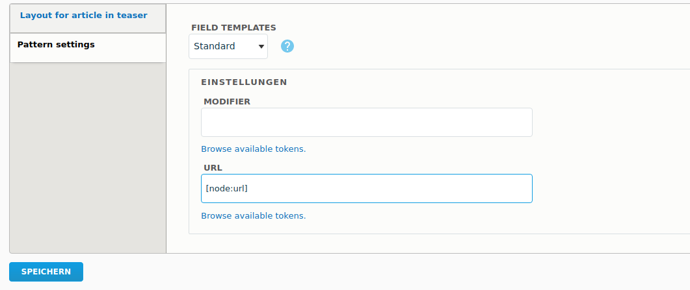

# UI Patterns Settings

INTRODUCTION
------------
Make UI Patterns configurable through settings.

Sample pattern:
```
card:
  label: Card
  description: A card component.
  variants:
    product:
      label: Artwork
      settings:
        modifier: artwork
        attributes: "class=\"shadow-bottom\""
  settings:
    modifier:
      type: textfield
      label: Modifier
      description: Add modifier here
    url:
      type: token
      label: Url
      default_value: "[node:url]"
    attributes:
      type: attributes
      label: Attributes
  fields:
    image:
      type: image
      label: Image
      description: Card image.
      preview:
        type: pattern
        id: image
        fields:
          image:
            theme: image
            uri: http://lorempixel.com/400/200/nature/2
    title:
      type: text
      label: Title
      description: Card title.
      preview: Card title
    text:
      type: text
      label: Text
      description: Card text.
      preview: Cras justo odio, dapibus ac facilisis in.
```
Sample card pattern template:
```

<a href="{{ url }}" class="card card--{{ modifier }} {{ attributes.class }}" 
{{ attributes|without('class') }}>
  <div class="thumbnail">
    {{ image }}
    <div class="caption">
      <h3>{{ title }}</h3>
      <p>{{ text }}</p>
    </div>
  </div>
</a>
```

**Sample Images:**
Settings in manage display:


Each settings type is a plugin. 
You can easily create your own setting types. 
**hook_preprocess is not needed any more**

**Currently available setting types are:**
- textfield
- select
- boolean
- checkbox (multi value)
- attributes
- token
- url (Generates urls from uri or user input. 
  Tokens are accepted. Useful for linkfield uris?)

REQUIREMENTS
------------

* ui patterns >= 1.1.

INSTALLATION
------------

* Install the UI Patterns Setting module as you would 
normally install a contributed
  Drupal module. Visit https://www.drupal.org/node/1897420. 
  
CONFIGURATION
------------

Navigate to Manage Display of your entity type select an pattern and 
you will find your configured settings.
